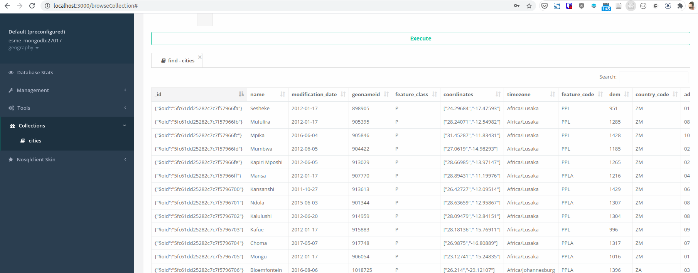

This docker stack run the necessary environment to perform nosql labs
on courses given at ESME Sudria.

This environment hosts these components :

* a mongodb ``geography`` database with a collection of 23799 cities
* an administration for mongodb built with [nosqlclient](https://www.nosqlclient.com/docs/index.html)



* ...

General information
===================

* [website](esme.farcellier.com)

Requirement 1 : installation to perform on your computer
========================================================

You will need those softwares on your computer :

* [Docker](https://www.docker.com/)
* [Git](https://git-scm.com/)

On linux
---------

* 1. [install docker](https://docs.docker.com/engine/install/ubuntu/)

* 2. install git

```
sudo apt-get install git
```

* 3. [install docker-compose](https://docs.docker.com/compose/install/#install-compose-on-linux-systems)

On windows
-----------

* 1. [install docker](https://docs.docker.com/docker-for-windows/install/)

* 2. [install git](https://git-scm.com/download/win)

On mac
-------

* 1. [install docker](https://docs.docker.com/docker-for-mac/install/)

* 2. install git

```
brew install git
```


Step 1 : install the environment
================================

1. clone this repository :

```
git clone https://github.com/Esme-Sudria-Database/lab-nosql.git
```

2. go on directory

```bash
cd lab-nosql
```

3. mount the lab

```bash
docker-compose up
```

## Contributors

* Fabien Arcellier
* Luc Marchand
