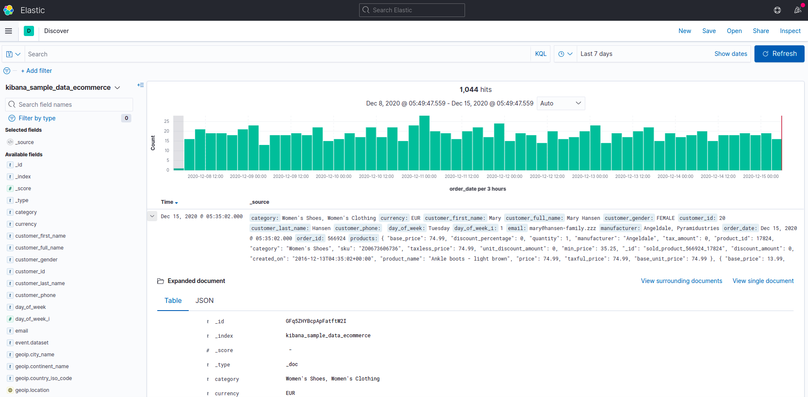

# Lab NoSQL for classes at esme sudria

This docker stack run the necessary environment to perform nosql labs
on courses given at ESME Sudria.

This environment hosts these components :

* a mongodb ``geography`` database with a collection of 23799 cities
* an administration for mongodb built with [nosqlclient](https://www.nosqlclient.com/docs/index.html)


* an empty elasticsearch database
* an administration for elasticsearch built with [kibana](https://www.elastic.co/fr/kibana)



## General information

* [website](esme.farcellier.com)

## Requirement 1 : installation to perform on your computer

You will need those softwares on your computer :

* [Docker](https://www.docker.com/)
* [Git](https://git-scm.com/)

On linux
---------

* 1. [install docker](https://docs.docker.com/engine/install/ubuntu/)

* 2. install git

```
sudo apt-get install git
```

* 3. [install docker-compose](https://docs.docker.com/compose/install/#install-compose-on-linux-systems)

On windows
-----------

* 1. [install docker](https://docs.docker.com/docker-for-windows/install/)

* 2. [install git](https://git-scm.com/download/win)

On mac
-------

* 1. [install docker](https://docs.docker.com/docker-for-mac/install/)

* 2. install git

```
brew install git
```


## Step 1 : install the environment

1. clone this repository :

```
git clone https://github.com/Esme-Sudria-Database/lab-nosql.git
```

2. go on directory

```bash
cd lab-nosql
```

3. mount the lab

```bash
docker-compose up
```

## Step 2 : explore mongodb database

The administration console is accessible through your internet browser.

```
http://localhost:3000
```

If you want to develop an application that uses this mongodb base, you
can connect through using the following string connection:

```bash
mongodb://esme_mongodb:27017/geography
```

* [Getting Started with Python and MongoDb](https://www.mongodb.com/blog/post/getting-started-with-python-and-mongodb)
* [Node.js MongoDB](https://www.w3schools.com/nodejs/nodejs_mongodb.asp)

## Step 3 : explore elasticsearch database

The administration console is accessible through your internet browser.

```
http://localhost:5601
```

As the database is empty, you can use for a first exploration [one of the 3 
datasets](http://localhost:5601/app/home#/tutorial_directory) which are proposed by default (sample ecommerce, sample flight data, sample web logs)

If you want to develop an application that uses this elasticsearch base, you
can use the API through the following url:

```
http://localhost:9200
```

* [Getting started with Elasticsearch in Python](https://towardsdatascience.com/getting-started-with-elasticsearch-in-python-c3598e718380)
* [Getting started with Elasticsearch and Node.js - Part 1](https://www.compose.com/articles/getting-started-with-elasticsearch-and-node/)

## Contributors

* Fabien Arcellier
* Luc Marchand
